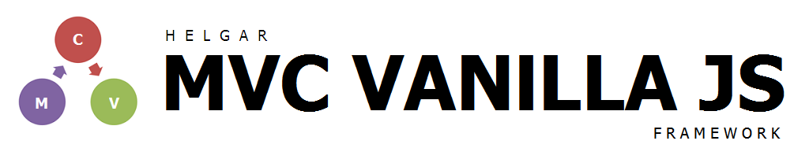

<b>MVC VANILLA JS</b> é um framework simples para o desenvolvimento de websites do tipo Single Page Application (SPA). É utilizado, para tanto, o padrão Model View Controller (MVC). Como seu nome revela, em seu desenvolvimento é utilizado Vanilla Javascript, isto é, Javascript puro, sem o auxílio de quaisquer frameworks externos. Se utiliza, além disto, uma série de tecnologias por padrão já embutidas nos navegadores modernos, como, por exemplo, HTML, CSS, API DOM, AJAX, etc.

## Filosofia

O termo <em>Vanilla</em>, quando utilizado no contexto de desenvolvimento de software, se refere a uma tecnologia usada em seu estado puro, sem qualquer customização. Assim, a princípo, talvez possa parecer uma contradição se estar oferecendo um framework que carregue este termo. Ora, frameworks podem ser considerados, pois, a forma mais comum de customização de linguagens de desenvolvimento.

Na verdade, o que se pretende oferecer é não somente uma caixa preta, o que normalmente é oferecido pelos frameworks convencionais, mas um conjunto consistente de boas práticas de codificação, principalmente no que se refere a organização dos arquivos e códigos que compõem um sistema, de modo que o desenvolvedor que optar por utilizá-lo tenha pleno conhecimento de "como as coisas funcionam".

O empodera, desta forma, não apenas para realizar as modificações que julgar necessárias, mas replicar tais técnicas, guardadas as devidas adaptações, utilizando de outras linguagens que não o Javascript. Em outras palavras, com o <b>MVC VANILLA JS</b> se tem grande preocupação não apenas em entregar as funcionalidades pertinentes a um framework MVC - os resultados -, mas de deixar muito bem claro como tais resultados foram alcançados, e, mais que isso, fazê-lo da maneira mais elegante possível. Tudo isto mantendo a sintaxe original do Javascript a mais intacta possível.

## Aviso
Importante esclarecer que, a princípio, trata-se de um teste. Fora criado originalmente para o desenvolvimento de website do tipo portfolio na plataforma GitHub Pages. Pode ser utilizado, no entanto, no desenvolvimento de qualquer tipo de sistema web, visto que, embora criado para o desenvolvimento de um projeto específico, os esforços foram direcionados no sentido de se criar uma estrutura de propósito geral.

Importante esclarecer, ainda,  que os conhecimentos sobre Javascript deste autor, bem como o de desenvolvimento de sistemas em geral, ao menos na data em que este projeto foi iniciado, podem ser considerados entre básicos e intermediários. Isto quer dizer que, neste momento, não necessariamente as soluções aqui apresentadas podem ser consideradas as mais adequadas. No entanto, a partir de esforços deste autor, e possívelmente com auxílio da comunidade, se pretende aprimorá-lo tanto quanto possível, ao ponto de viabilizar sua utilização, com comodidade e segurança, as mais variadas aplicações.

## Em construção

Este repositório está em processo inicial de construção e, por hora, se encontra vazio. Tão logo haja algum desenvolvimento, no entanto, será imediatamente atualizado.
